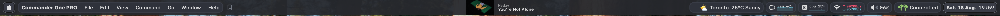

# 🎨 Modern SketchyBar Configuration

A powerful, modular, and visually stunning SketchyBar configuration for macOS, featuring real-time system monitoring, media controls, and seamless integration with window managers.



## ✨ Features

### System Monitoring
- **📊 Real-time Performance Graphs** - CPU, RAM, and network usage with color-coded thresholds
- **🔋 Battery Status** - Smart battery monitoring for laptops with charging indicators
- **🌐 Network Speed** - Upload/download speeds with automatic interface detection
- **🎧 Audio Controls** - Volume slider with device switching capabilities

### Media & Entertainment
- **🎵 Media Widget** - Spotify/Apple Music integration with album artwork
- **🎙️ AirPods Battery** - Real-time AirPods battery status
- **🌤️ Weather Widget** - Current conditions with moon phase display

### Productivity
- **🪟 Workspace Management** - AeroSpace/Yabai window manager integration
- **📱 App Icons** - Dynamic front app display with custom icons
- **📅 Calendar** - Clean date/time display with customizable format
- **🍎 Native Menus** - macOS-style dropdown menus

### Technical Highlights
- **⚡ High-Performance C Binaries** - Native event providers for minimal CPU overhead
- **🔧 Lua Configuration** - Clean, modular configuration system
- **🎨 Adaptive Theming** - Automatic color adjustments based on system state
- **📦 Zero Dependencies** - All required components installed automatically

## 🚀 Quick Start

### One-Line Installation

```bash
git clone https://github.com/BarutSRB/HyprBar ~/.config/sketchybar && cd ~/.config/sketchybar && ./install.sh
```

### Manual Installation

1. **Clone the repository:**
```bash
git clone https://github.com/BarutSRB/HyprBar ~/.config/sketchybar
cd ~/.config/sketchybar
```

2. **Run the installer:**
```bash
./install.sh
```

The installer will:
- ✅ Install SketchyBar via Homebrew
- ✅ Download and configure SbarLua module
- ✅ Install required fonts
- ✅ Compile C event providers
- ✅ Detect your network interface and device type
- ✅ Configure and start SketchyBar

## 🎨 Customization

### Configuration File

Edit `config.lua` to enable/disable widgets:

```lua
M.widgets = {
  cpu = true,           -- CPU usage graph
  ram = true,           -- RAM usage graph
  network = true,       -- Network speeds
  battery = false,      -- Battery status (auto-enabled for laptops)
  volume = true,        -- Volume controls
  media = true,         -- Spotify/Apple Music
  weather = true,       -- Weather widget
  -- ... more options
}
```

### Themes

Modify colors in `colors.lua`:
```lua
return {
  black = 0xff181926,
  white = 0xffcad3f5,
  red = 0xffed8796,
  green = 0xffa6da95,
  blue = 0xff8aadf4,
  -- ... customize your palette
}
```

### Fonts

The configuration supports:
- **SF Pro** (default) - Apple's system font
- **JetBrains Mono** (fallback) - Great monospace alternative

Switch fonts in `settings.lua`.

## 🛠️ Requirements

### System Requirements
- macOS 11.0 or later
- Apple Silicon or Intel Mac
- Xcode Command Line Tools

### Installed Automatically
- Homebrew
- SketchyBar
- SbarLua module
- Required fonts
- C compiler (via Xcode CLT)

### Optional (Recommended)
- [AeroSpace](https://github.com/nikitabobko/AeroSpace) - Tiling window manager
- [Yabai](https://github.com/koekeishiya/yabai) - Alternative window manager

## 📁 Project Structure

```
sketchybar/
├── install.sh          # Automated installer
├── config.lua          # User configuration
├── init.lua            # Main entry point
├── colors.lua          # Theme colors
├── settings.lua        # Global settings
├── items/              # Widget definitions
│   ├── spaces.lua      # Workspace management
│   ├── media.lua       # Media controls
│   └── widgets/        # System monitors
├── helpers/            # Utilities and C sources
│   ├── event_providers/# C binaries for monitoring
│   └── widget_utils.lua# Helper functions
└── plugins/            # Shell scripts for integration
```

## 🔧 Troubleshooting

### Common Issues

**SketchyBar not showing:**
```bash
brew services restart sketchybar
sketchybar --reload
```

**Widgets not updating:**
```bash
# Check if event providers are running
ps aux | grep -E "cpu_load|network_load"

# Rebuild C binaries
cd ~/.config/sketchybar/helpers && make clean && make
```

**Network monitor showing "???":**
```bash
# Find your network interface
ifconfig | grep -E "^en[0-9]"
# Update config.lua with the correct interface
```

### Logs

View SketchyBar logs:
```bash
tail -f /tmp/sketchybar_*.out
```

## 🤝 Contributing

Contributions are welcome! Feel free to:
- Report bugs
- Suggest features
- Submit pull requests

## 📝 License

This configuration is provided as-is for personal use. Feel free to modify and share!

## 🙏 Credits

- [FelixKratz](https://github.com/FelixKratz) - Creator of SketchyBar and SbarLua
- [r/unixporn](https://reddit.com/r/unixporn) - Inspiration and community
- All contributors and users of this configuration

---

<div align="center">
Made with ❤️ for the macOS community
</div>